# Presentation Diagrams

## 1. Courier system
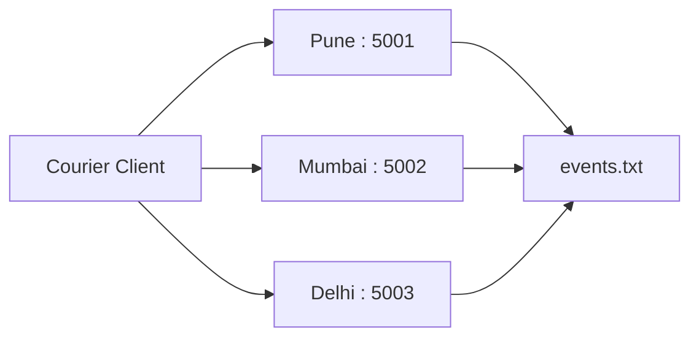
## 2. Lamport clock
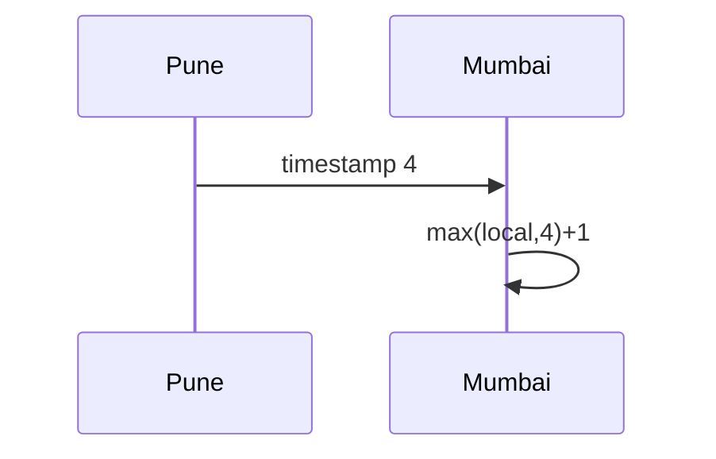
## 3. Vector clock
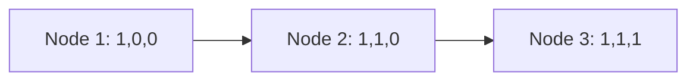
## 4. Leader election
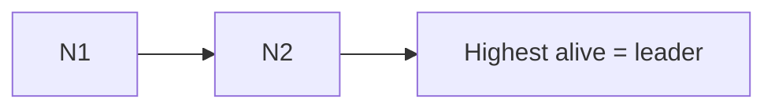
## 5. Mutual exclusion
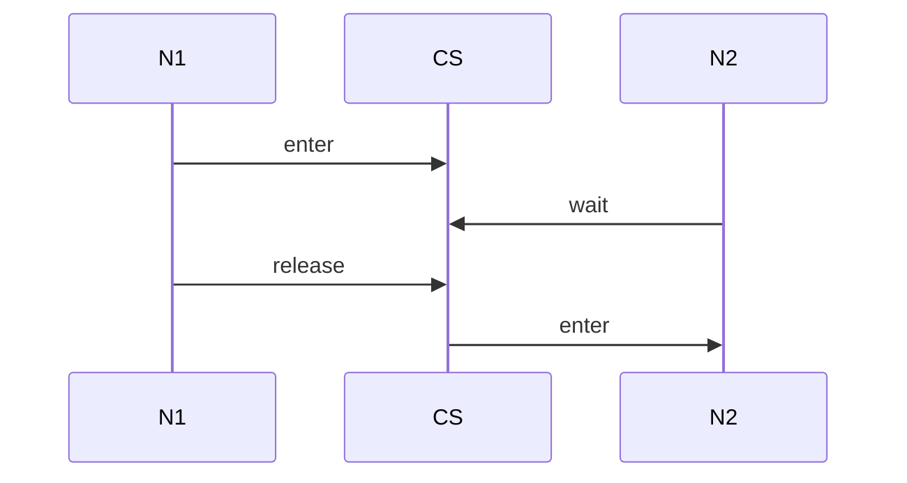
## 6. Beacon protocol
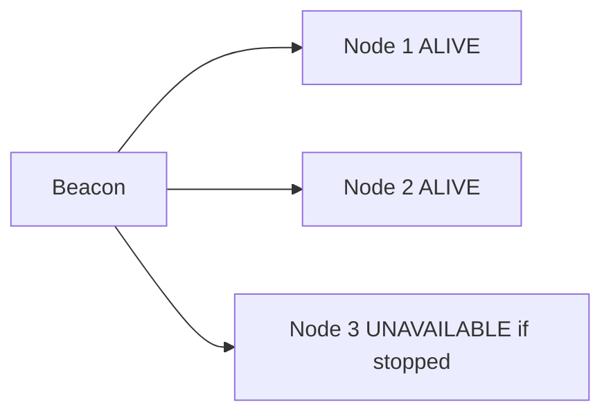
## 7. Global state
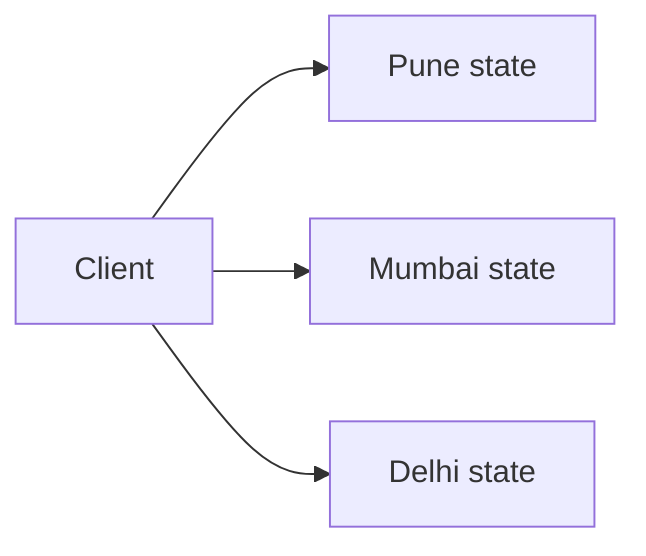
## 8. DFS
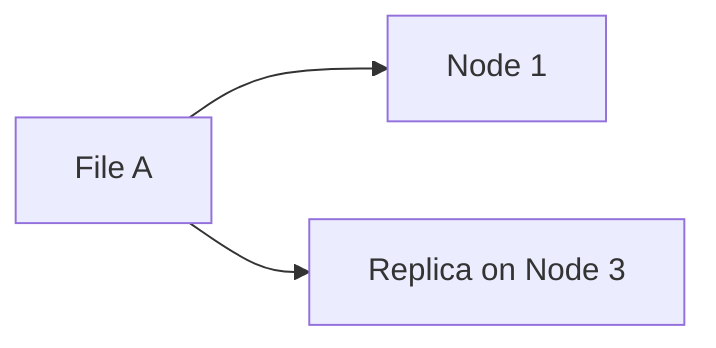
## 9. Serverless
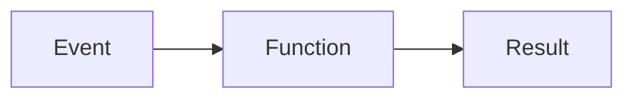
## 10. Hadoop
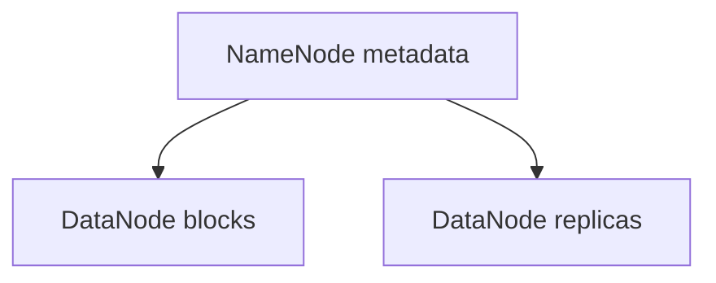
## 11. Kubernetes
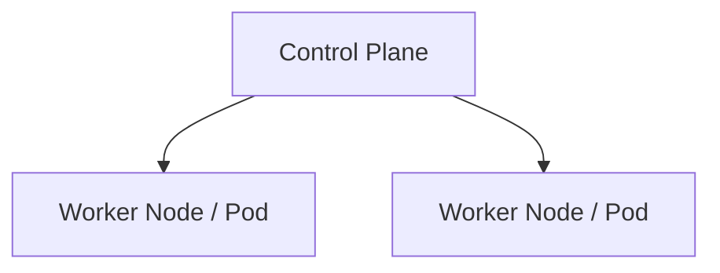
## 12. Blockchain

