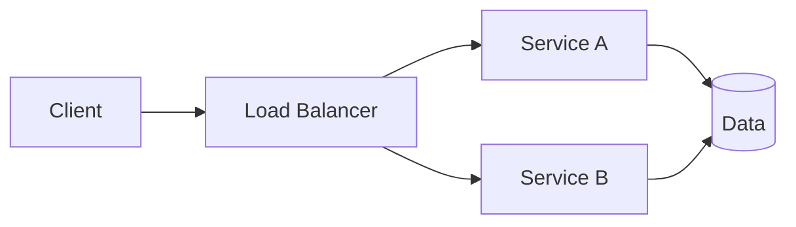

# Distributed Web-Based Systems

A browser or mobile client calls web servers and APIs. Multiple services may handle users, orders, tracking and notifications. A load balancer spreads requests among instances, allowing scalability and failure recovery. An e-commerce website is a common example.

Benefits include independent scaling; challenges include latency, service failures, consistency and API security.
